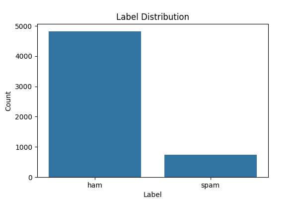
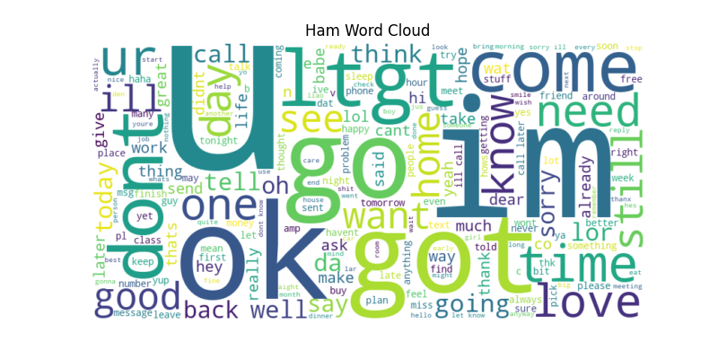
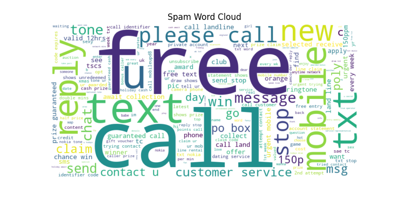
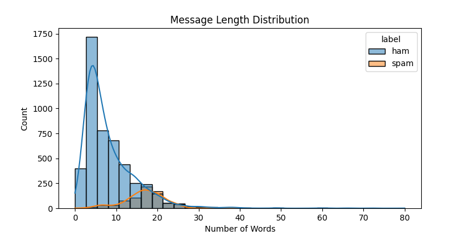
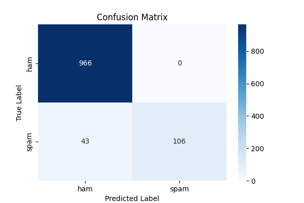
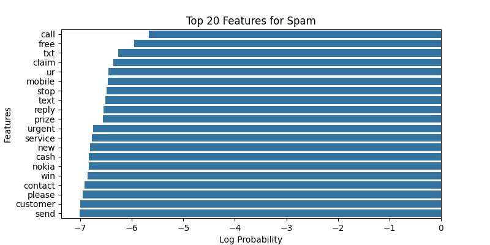

# SMS Spam Classification

A simple Naive Bayes approach to detect spam vs. ham messages.  
Generates various plots for data insights.

##Plots

## Example Results
precision    recall  f1-score   support

ham  0.96  1.00  0.98   966
spam 1.00  0.71  0.83   149

Accuracy = 0.96
